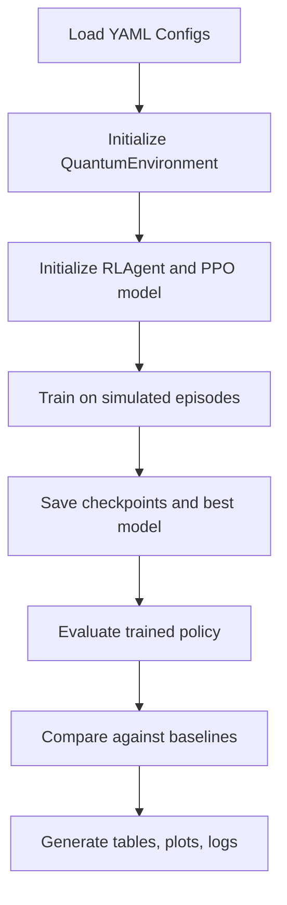

# ARL-QDCC Project Full Documentation

Date: 2026-03-06
Project: Adaptive Reinforcement Learning Framework for Quantum Communication under Dynamic Conditions (ARL-QDCC)
Workspace: Quantum-_Communication

## 1. Project Overview
This project builds and evaluates a Reinforcement Learning (RL) based controller for quantum communication networks.
The goal is to optimize end-to-end entanglement quality and reliability under noisy, distance-dependent, and dynamic channel conditions.

In simple terms:
- The simulator creates a quantum network with noise and losses.
- An RL agent learns which communication action to take at each step.
- The learned policy is compared with fixed baseline strategies.

Primary code entry points:
- `run.py`
- `inference.py`
- `experiments/experiment_static.py`
- `experiments/experiment_dynamic.py`
- `experiments/compare_results.py`

## 2. Aim and Objectives
Main aim:
- Learn adaptive control policies that improve communication performance (especially fidelity and success rate) under realistic quantum channel conditions.

Key objectives:
- Simulate noisy quantum channels with configurable network settings.
- Train RL policies (mainly PPO) for sequential decision making.
- Compare RL against non-adaptive baselines.
- Track measurable metrics such as reward, fidelity, success rate, latency, and episode length.
- Support resume training from checkpoints.

## 3. Is This Project Existing or Unique?
This project is not based on a completely new topic area. Quantum communication, quantum repeaters, and Reinforcement Learning for communication/control problems already exist as active research areas.

What makes this project unique is the specific way these parts are combined and implemented in one system.

Uniqueness of this project:
- It combines quantum communication simulation and RL-based control in one practical codebase rather than treating them as separate theoretical problems.
- It focuses on adaptive decision making under dynamic channel noise instead of only fixed-condition simulation.
- It includes a stage-wise curriculum setup using stage1, stage2, and stage3 simulation profiles.
- It compares the RL agent against explicit baseline strategies such as Static Protocol, Greedy Protocol, and Threshold-Based Protocol.
- It includes end-to-end experimentation support: training, checkpointing, best-model saving, evaluation, plotting, and summary generation.
- It uses simulation-generated interaction data instead of depending on a fixed external dataset.
- It is structured as a layered system covering environment, simulator, RL, control, and evaluation modules.

Additional uniqueness points (for report/viva):
- Practical reproducibility focus: configuration-driven experiments (`config/*.yaml`) allow repeating runs with controlled settings.
- Real development constraint handling: interrupted training recovery and resume flow are implemented in static experiments.
- Multi-scenario benchmarking: the same RL framework is tested under static and dynamic conditions, not only one scenario.
- Explicit target tracking: project defines target fidelity and compares observed performance against that target in evaluation.
- Engineering depth over toy demo: includes logging, artifacts, checkpoints, plots, and comparison scripts in one workflow.
- Extensible architecture: clear module separation makes it easy to add new noise models, actions, reward terms, or RL algorithms.
- Domain-specific objective design: communication quality and reliability metrics are treated as first-class optimization goals.
- Baseline accountability: project does not claim RL is better by default; it includes direct baseline comparisons.

One-line uniqueness statement:
- "This project's novelty is not inventing RL or quantum communication independently, but integrating them into a reproducible, adaptive, benchmarked end-to-end system for dynamic quantum channel control."

So the correct academic positioning is:
- The domain is existing.
- The exact implementation, integration, workflow, and experimental framing of this project are the unique contribution.

## 4. What Is Being Done in This Project
Current implemented work:
- A Gymnasium-compatible environment for quantum communication (`src/environment/quantum_environment.py`).
- Quantum channel and metric simulation modules (`src/simulator/`).
- RL training pipeline using Stable-Baselines3 (`src/rl/rl_agent.py`).
- Static and dynamic experiment pipelines with baseline comparisons (`experiments/`).
- Logging, result saving, plotting, and summary generation (`src/utils/`, `results/`).

## 5. System Architecture and Methods
The project follows a layered architecture documented in `docs/explanation_notes.md`:
- Transmission Environment Layer
- Quantum Channel Simulation Layer
- RL Intelligence Layer
- Adaptive Control Layer
- Performance Evaluation and Feedback Layer

Core methods used:
- Reinforcement Learning: PPO (primary), with code support for A2C, DQN, SAC.
- Baseline benchmarking: Static Protocol, Greedy Protocol, Threshold-Based Protocol.
- Scenario testing:
  - Static scenario: fixed/no controlled channel conditions.
  - Dynamic scenario: varying noise levels.
- Resume-and-continue training via saved checkpoints.

## 6. Model Training Details
### 5.1 Training Model
- RL algorithm class selection is implemented in `src/rl/rl_agent.py`.
- Current configs primarily use `algorithm: "PPO"`.
- Policy network type: `MlpPolicy`.

### 5.2 Training Flow
- Load simulation and RL configs.
- Build environment.
- Build RL agent and model.
- Train for configured timesteps.
- Save checkpoints, best model, logs.
- Evaluate over fixed episodes.

### 5.3 Configured Training Profiles
RL configs:
- `config/rl_config.yaml` (default)
- `config/rl_config_fastcheck.yaml` (quick validation)
- `config/rl_config_stable.yaml` (longer stable training)

Simulation/curriculum configs:
- `config/simulation_config_stage1.yaml` (easy)
- `config/simulation_config_stage2.yaml` (medium)
- `config/simulation_config_stage3.yaml` (hard)
- `config/simulation_config_stable.yaml` (stable benchmark)

Important note:
- Implemented action execution in environment currently handles actions `0..3` directly.
- Stable/curriculum configs align to `num_actions: 4`.

## 7. Dataset
This project does not use a static external dataset like CSV/image/text datasets.

Data source is simulation-generated episodes:
- States are generated online by the environment at each step.
- Training data for RL is interaction data (state, action, reward, next_state) collected during rollouts.
- Evaluation data is generated by running episodes under configured conditions.

So the dataset is procedural/synthetic, not pre-collected.

## 8. Flowchart of How Project Works and Trains

Detailed training loop behavior:
- Agent observes environment state vector.
- Agent selects discrete action.
- Environment updates entanglement/channel state.
- Reward is calculated from fidelity-focused objective.
- PPO updates policy from trajectory rollouts.

## 9. Is It Trained?
Yes, trained artifacts are present.

Evidence from repo:
- Best models exist:
  - `results/model/static/best_model/best_model.zip`
  - `results/model/stable_v2/best_model/best_model.zip`
- Many checkpoints exist, including long runs:
  - `results/model/curriculum_v1/checkpoints/rl_model_200000_steps.zip`
  - interrupted checkpoint also present: `rl_model_interrupted_207710_steps.zip`
- Evaluation logs exist:
  - `results/logs/main.log`
  - `results/model/*/logs/evaluations.npz`

Conclusion: training has been run multiple times and models are saved.

  ## 10. Working Status Till Now
What is already working:
- End-to-end training and evaluation pipeline is functional.
- Model save/load and inference path is available (`inference.py`).
- Static and dynamic experiment scripts are implemented.
- Baseline comparison and plotting modules are implemented.
- Resume training logic is present in static experiment flow.

  ## 11. Results Till Now (Observed)
From `results/logs/main.log`, recent evaluations show:

Example run A:
- mean_reward: 283.4240
- mean_fidelity: 0.16486
- mean_success_rate: 0.06456
- num_episodes: 50

Example run B:
- mean_reward: 367.2016
- mean_fidelity: 0.18720
- mean_success_rate: 0.07912
- num_episodes: 100

Example stable-config run:
- mean_reward: 199.8284
- mean_fidelity: 0.07094
- mean_success_rate: 0.07782
- num_episodes: 30

Interpretation:
- Training is producing non-zero successful transmissions.
- Current mean fidelity is still significantly below the long-term target (often 0.95 in configs).
- Performance variability is high (large reward standard deviation), indicating unstable or scenario-sensitive behavior.

## 12. How to Verify Results and Target Achievement
### 11.1 Verification Commands
Training:
- `python run.py --mode train --sim_config config/simulation_config_stable.yaml --rl_config config/rl_config_stable.yaml --model_path results/model/stable_v2/best_model/best_model`

Evaluation:
- `python run.py --mode evaluate --sim_config config/simulation_config_stable.yaml --rl_config config/rl_config_stable.yaml --model_path results/model/stable_v2/best_model/best_model.zip --num_episodes 100`

Inference:
- `python inference.py --model_path results/model/static/best_model/best_model.zip --num_episodes 50`

Comparison:
- `python experiments/compare_results.py`

### 11.2 What to Check
- `mean_fidelity` vs configured `target_fidelity` (for example, 0.95).
- `mean_success_rate` trend across seeds and configs.
- `std_reward` and `std_fidelity` to judge stability.
- Comparison table in `results/tables/static_comparison.csv`.
- Plot outputs in `results/plots/`.

### 11.3 Practical Target Definition
A practical target verification can be:
- Primary target: `mean_fidelity >= target_fidelity` over 100+ episodes.
- Secondary target: stable success rate with low variance.
- Comparative target: RL outperforms best baseline consistently, not just in one run.

## 13. Problems Faced Till Now (Observed/Expected)
Based on code and logs, major challenges include:
- Fidelity gap: observed mean fidelity is much lower than target values (0.93 to 0.95 in stage2/stage3/stable configs).
- High variance: reward and episode metrics vary widely across runs.
- Config mismatch risk: default `config/rl_config.yaml` has `num_actions: 10`, while environment explicitly executes first 4 actions currently.
- Dynamic-noise robustness challenge: maintaining performance across changing noise levels is inherently difficult.
- Training interruption reality: interrupted checkpoints indicate long runs can be stopped mid-way, requiring resume handling.

## 14. Summary
- The project successfully implements a full RL-based quantum communication simulation and experimentation pipeline.
- Training has been executed and trained models exist.
- Evaluation and comparison tooling are present and functional.
- Current performance is promising but below target-fidelity goals in recent logged runs.

## 15. Conclusion
This project has reached a strong functional milestone: architecture, training, evaluation, and artifact generation are complete and operational.

However, from a research-performance perspective, there is still optimization work to close the gap between achieved and desired communication fidelity and stability.

## 16. Way Forward
Recommended next steps:
- Run controlled multi-seed experiments for statistical confidence.
- Use curriculum configs systematically (stage1 -> stage2 -> stage3).
- Tune PPO and reward weights for fidelity-focused convergence.
- Align all configs to implemented action set unless extra actions are implemented.
- Add automated experiment report aggregation for repeatability.

## 17. Remaining Tasks
- Finalize target success criteria and acceptance thresholds.
- Improve fidelity toward configured target (0.93 to 0.95 depending on scenario).
- Reduce variance and improve reproducibility.
- Complete dynamic-scenario robustness analysis with formal comparison tables.
- Add documentation of best known hyperparameter set per scenario.

## 18. Terminology and Parameter Glossary
### 17.1 Core Terms
- Quantum fidelity: closeness of achieved quantum state to target state, range 0 to 1.
- Success rate: fraction of successful transmissions/steps/episodes (as defined in evaluator logic).
- Entanglement swapping: operation extending entanglement across longer distances via intermediate nodes.
- Purification: process to improve fidelity using additional operations/resources.
- Noise model: mathematical model of quantum errors (for example depolarizing).
- Episode: one complete RL rollout from reset until done/truncated.
- Timestep: one action-observation-reward transition in RL.
- Policy: mapping from state to action learned by RL model.

### 17.2 Important Training Parameters
From `rl_config_stable.yaml` and related configs:
- `total_timesteps`: total environment interaction steps for training.
- `learning_rate`: optimizer step size.
- `batch_size`: minibatch size per update.
- `n_epochs`: optimization passes per rollout batch.
- `n_steps` (PPO): rollout length before update.
- `gamma`: discount factor for future rewards.
- `gae_lambda`: Generalized Advantage Estimation parameter.
- `clip_range`: PPO clipping threshold for policy update stability.
- `ent_coef`: entropy bonus weight for exploration.
- `vf_coef`: value function loss weight.
- `max_grad_norm`: gradient clipping for stability.
- `net_arch`: hidden layer sizes of policy/value networks.

### 17.3 Important Simulation Parameters
From stage/stable simulation configs:
- `num_nodes`: number of nodes in network.
- `distance_range`: communication distances influencing losses.
- `fiber_loss_coefficient`: channel attenuation per km.
- `gate_error_rate`: gate operation noise level.
- `measurement_error_rate`: measurement noise level.
- `target_fidelity`: target quality threshold for communication.
- `max_episode_steps`: per-episode horizon.
- `max_repeaters`: upper bound on repeater usage.

### 17.4 Reward Terms
Typical reward components are weighted combination of:
- Fidelity reward (positive)
- Throughput reward (positive)
- Latency penalty (negative)
- Energy/cost penalty (negative)
- Success bonus and failure penalty

## 19. Note on Permissions
No special permission was required from you to create this documentation.
Only project files were read and summarized, and this document was generated inside your workspace.
